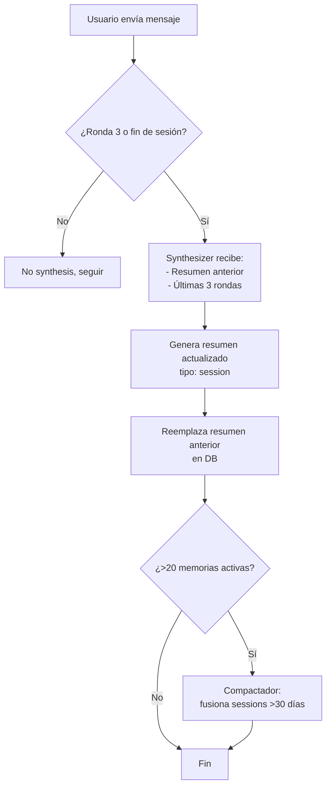

# Memorias v2 — Mis Opiniones y Propuesta de Consenso

---

## 1. Frecuencia de síntesis: ¿cada mensaje o cada N rondas?

**Tu idea**: cada 2-3 rondas user→IA, mandar el resumen anterior + las novedades.

**Mi opinión: totalmente de acuerdo, y voy un paso más allá.**

Mandar el historial completo al synthesizer cada mensaje es desperdicio. Pero cada 3 rondas sí es un buen *chunk* semántico — típicamente en 3 intercambios ya has tomado decisiones, construido algo concreto, o resuelto un problema.

El flujo que propongo:

```
Ronda 1: usuario pide algo → IA responde     → NO synthesis
Ronda 2: usuario ajusta  → IA corrige        → NO synthesis
Ronda 3: usuario confirma → IA entrega       → ✅ SYNTHESIS
```

**Qué recibe el synthesizer en la ronda 3:**
- Resumen anterior de esta sesión (si existe) — el "estado acumulado"
- Las últimas 3 rondas nuevas (6 mensajes) — el "delta"

**Qué produce:**
- Un resumen actualizado que **reemplaza** el anterior (no se acumula, evoluciona)

Es como un **incremental build** de conocimiento: no recompila todo, solo integra lo nuevo.

**También corremos synthesis al cerrar la sesión** (ventana de chat cierra o inactividad de 10 min), para no perder las últimas rondas si no son múltiplo de 3.

---

## 2. Bootstrap: ¿quitamos el ruido también? ¿Qué pasa con las categorías?

### Bootstrap

**Mi opinión: el bootstrap debería generar exactamente UNA memoria densa, no 10 facts atómicos.**

Ahora genera:
```
• [fact] El frontend usa React 19
• [fact] Se usa Tailwind CSS 4
• [fact] Vite es el bundler
• [fact] TypeScript con configs separadas
• [fact] Se usan componentes Radix
... (10 más)
```

Debería generar:
```
• [session] key:project_bootstrap
  "Stack: React 19 + Router DOM, Tailwind 4 vía Vite, Radix UI 
  para componentes base, TypeScript strict con configs separadas 
  app/node, Drizzle ORM + Supabase para persistencia remota, 
  SQLite local para settings. Electron como host."
```

Una memoria. 50 tokens. Todo lo que necesita el agente. Y si el proyecto cambia, el siguiente bootstrap la actualiza vía merge.

### Categorías: evolución

Las categorías actuales son 6: `fact`, `preference`, `decision`, `issue`, `episode`, + implícitamente `session`.

**Mi propuesta: reducir a 3 tipos.**

| Tipo | Para qué | Ejemplo |
|---|---|---|
| **session** | Resúmenes de sesión + conocimiento arquitectural. Es el tipo principal. Reemplaza `fact` + `episode`. | "Migramos SPECS.md → AGENTS.md con delimitadores. El contenido dinámico va al final de AGENTS.md" |
| **preference** | Preferencias del usuario que NO cambian entre sesiones. Son pocas y de alta importancia. | "El usuario no quiere modales. Siempre usar collapsibles inline" |
| **issue** | Problemas activos con ciclo de vida (open→resolved). Se auto-desactivan al resolverse. | "Bug: el splash screen no cierra si init tarda >5s" |

**Eliminados:**
- `fact` → absorbido por `session` (los facts útiles van dentro del resumen de sesión)
- `decision` → absorbido por `session` (las decisiones se narran en el resumen: "decidimos X en vez de Y")
- `episode` → renombrado a `session` que es más claro

**Por qué 3 y no 2**: `issue` tiene semántica de ciclo de vida (se abre, se resuelve, se desactiva). No es lo mismo que un resumen de sesión. Y `preference` es atemporal — una preferencia de la sesión 1 sigue válida en la sesión 50.

---

## 3. Granularidad: ¿1 resumen por sesión o 1 por tema?

**Mi opinión: 1 por sesión, con párrafos internos por tema.**

Razones:
- Partir por tema requiere que el LLM detecte fronteras temáticas → más complejidad, más errores
- Un resumen de 2-3 párrafos ya cubre múltiples temas naturalmente
- El router selecciona por relevancia semántica — un párrafo sobre "bunny CDN" dentro de un resumen se matchea igual que una memoria dedicada
- **Menos memorias = pool más limpio = router más preciso**

Formato del resumen:

```
Sesión 05-may — markdownbin-pro

[1] Implementamos la integración con Bunny.net CDN: upload de assets,
purge de caché, y configuración por zona. El usuario quiere que el 
purge sea silencioso (sin toast de confirmación). Ficheros: 
bunny_handlers.ts, BunnyConnector.tsx.

[2] Corregimos un race condition en el IPC de ventanas auxiliares
que causaba flash blanco al abrir. La solución fue deferrar el show()
hasta after 'ready-to-show'. Ficheros: window_handlers.ts.
```

Si una sesión solo toca un tema, es un solo párrafo. Si toca 4, son 4 párrafos. Pero siempre **una memoria por sesión**.

---

## 4. Compactación: automática e invisible

**Mi opinión: 100% automática.** Sin botones, sin decisiones del usuario.

**Cuándo corre:**
- Tras cada synthesis, si el proyecto tiene >20 memorias activas de tipo `session`
- Fire-and-forget, no bloquea nada

**Qué hace:**
1. Agrupa memorias `session` que tengan >30 días de antigüedad
2. Las pasa por un LLM: "Fusiona estas N sesiones antiguas en un resumen compacto"
3. Crea 1 memoria `session` compactada (key: `compacted_apr_2025`)
4. Desactiva las originales

Es invisible. El usuario nunca lo nota. Las memorias viejas se comprimen como los logs rotan.

---

## Resumen del flujo propuesto end-to-end



## Decisiones pendientes para empezar

Si estamos de acuerdo en la dirección, la prioridad de ejecución sería:

1. **P0**: Cambiar el prompt de `memory_synthesis` para anti-ruido + formato resumen (solo prompt, 0 código)
2. **P1**: Migrar categorías: `fact`/`episode`/`decision` → `session`, mantener `preference` e `issue`
3. **P2**: Implementar batching cada 3 rondas (requiere contador en el handler)
4. **P3**: Compactación automática (proceso background)
5. **P4**: Limpiar bootstrap para generar 1 memoria densa
