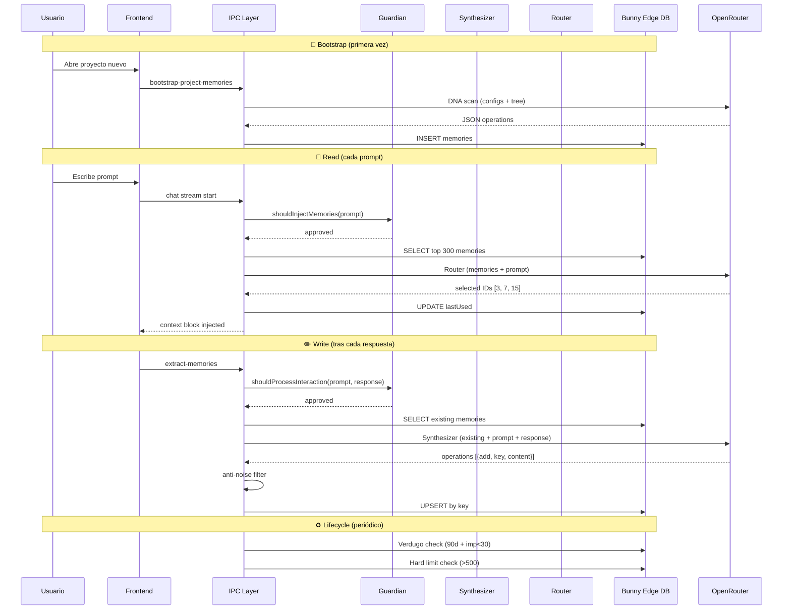

# Sistema de Memorias — Documentación Holística

## 🧠 Visión general

Las **memorias** son el sistema de conocimiento persistente del agente. Permiten que el AI recuerde decisiones arquitectónicas, stack tecnológico, preferencias del usuario y bugs activos **entre sesiones de chat**. Cada proyecto (app) tiene su propio set de memorias aislado.

> [!IMPORTANT]
> Sin memorias, el agente empieza cada chat de cero. Con memorias, sabe desde el primer mensaje que "el backend usa Fastify con Drizzle ORM y la BD es PostgreSQL".

---

# Parte 1: Arquitectura Técnica

## Pipeline completo

```mermaid
flowchart TB
    subgraph COLD["🧬 Cold Start (Bootstrap)"]
        B1["Phase 1: DNA Scan"] -->|"configs + tree"| LLM1["OpenRouter LLM"]
        LLM1 -->|"JSON operations"| DB1["DB: memories"]
        B2["Phase 2: Explore"] -->|"OpenCode subagent"| DB1
    end

    subgraph WRITE["✏️ Write Pipeline (por cada ciclo de chat)"]
        G["Guardian T1"] -->|"¿trivial?"| SKIP["Skip"]
        G -->|"approved"| S["Synthesizer V3"]
        S -->|"LLM call"| OPS["operations: add/update/merge"]
        OPS -->|"anti-noise filter"| DB2["DB: memories"]
    end

    subgraph READ["📖 Read Pipeline (por cada prompt del usuario)"]
        GR["Guardian Inject"] -->|"¿trivial?"| SKIP2["Skip"]
        GR -->|"approved"| R["Router LLM"]
        R -->|"selects 0-10 IDs"| CTX["Context Block"]
        CTX -->|"injected into"| AGENT["System Prompt del agente"]
    end

    subgraph LIFECYCLE["♻️ Lifecycle"]
        V["Verdugo"] -->|"90d sin uso + imp<30"| DIS["Disabled"]
        HL["Hard Limit"] -->|">500 activas"| PRUNE["Prune 50 peores"]
    end
```



---

## Archivos clave

| Archivo | Rol | Pipeline |
|---|---|---|
| [memory_bootstrap.ts](file:///home/munix/Desarrollo/GitRepo/minube-vibes/src/ipc/utils/memory_bootstrap.ts) | Cold start: DNA scan + Explore | Bootstrap |
| [memory_guardian.ts](file:///home/munix/Desarrollo/GitRepo/minube-vibes/src/ipc/utils/memory_guardian.ts) | Filtros determinísticos (<1ms) | Read + Write |
| [memory_extractor.ts](file:///home/munix/Desarrollo/GitRepo/minube-vibes/src/ipc/utils/memory_extractor.ts) | Synthesizer V3: extrae memorias de chats | Write |
| [memory_context_builder.ts](file:///home/munix/Desarrollo/GitRepo/minube-vibes/src/ipc/utils/memory_context_builder.ts) | Router: selecciona memorias relevantes | Read |
| [memory_lifecycle.ts](file:///home/munix/Desarrollo/GitRepo/minube-vibes/src/ipc/utils/memory_lifecycle.ts) | Verdugo, hard limit, issue transitions | Lifecycle |
| [memory_telemetry.ts](file:///home/munix/Desarrollo/GitRepo/minube-vibes/src/ipc/utils/memory_telemetry.ts) | Logging de pipeline a DB | Observabilidad |
| [memory_debug_log.ts](file:///home/munix/Desarrollo/GitRepo/minube-vibes/src/ipc/utils/memory_debug_log.ts) | Volcado de prompts a `/tmp/opencode/` | Debug |
| [memory.ts](file:///home/munix/Desarrollo/GitRepo/minube-vibes/src/ipc/types/memory.ts) | IPC contracts + schemas Zod | Tipos |
| [memory_handlers.ts](file:///home/munix/Desarrollo/GitRepo/minube-vibes/src/ipc/handlers/memory_handlers.ts) | Handlers IPC (CRUD + pipeline triggers) | IPC |
| [remote-schema.ts](file:///home/munix/Desarrollo/GitRepo/minube-vibes/src/db/remote-schema.ts#L454-L472) | Tabla `memories` en Drizzle | DB |
| [prompts/index.ts](file:///home/munix/Desarrollo/GitRepo/minube-vibes/src/prompts/index.ts) | System prompts de Synthesis, Router y Onboarding | Prompts |

---

## Modelo de datos (DB)

```
memories
├── id            INTEGER PK AUTOINCREMENT
├── userId        TEXT FK → users.id
├── appId         INTEGER (0 = global)
├── type          TEXT: fact | preference | issue | episode | decision
├── key           TEXT nullable (ej: "backend_framework") — para upsert
├── content       TEXT (la memoria en sí, en español)
├── importance    INTEGER 0–100 (mapeado a 0.0–1.0 en la API)
├── status        TEXT nullable (solo para issues: active → fix_attempted → suspected_resolved → resolved → deprecated)
├── source        TEXT: "auto" | "manual"
├── sourceChatId  INTEGER nullable
├── enabled       INTEGER (1 = activa, 0 = deshabilitada)
├── createdAt     TIMESTAMP
├── updatedAt     TIMESTAMP
└── lastUsed      TIMESTAMP nullable (actualizado por el Router cada vez que selecciona esta memoria)
```

**Tablas auxiliares:**
- `memory_telemetry` — contadores por acción (skipped_trivial, synthesized, routed, etc.)
- `memory_pipeline_logs` — payloads completos de cada llamada LLM (system prompt, user message, raw response, duración)

---

## Bootstrap (Cold Start)

Cuando un proyecto es nuevo o no tiene memorias, se ejecuta automáticamente:

### Phase 1: DNA Scan (~3-5s)
1. Lee archivos de configuración del proyecto: `package.json`, `tsconfig.json`, `docker-compose.yml`, etc. (14 patterns fijos + 8 globs)
2. Lee `AGENTS.md` y `DESIGN.md` si existen
3. Genera el árbol de directorios (2 niveles)
4. Envía todo a OpenRouter con el prompt `memory_onboarding`
5. **Timeout: 15 segundos** con 1 retry automático
6. Recibe JSON con `operations: [{action: "add", type, key, content, importance}]`
7. Máximo **10 memorias** por DNA scan

### Phase 2: Explore (~20s)
- Lanza un sub-agente OpenCode en modo read-only
- El agente navega el codebase libremente para descubrir patrones no visibles en configs
- Genera memorias complementarias a las del DNA

### Regla de consolidación (nueva)
El prompt de onboarding instruye explícitamente al LLM a **no fragmentar**: plugins/middleware del mismo framework → 1 sola memoria. Ejemplo: Fastify + CORS + Helmet + rate limiting = 1 memoria `backend_middleware`, no 4.

---

## Write Pipeline (Synthesizer V3)

Se ejecuta **tras cada ciclo de chat** (fire-and-forget, nunca bloquea):

```
User prompt + AI response
       ↓
  Guardian T1 (determinístico, <1ms)
  - ¿Es "ok", "vale", "gracias"? → skip (trivial_ack)
  - ¿Prompt < 10 chars sin tech? → skip (short_no_tech)
  - ¿Response sin contenido técnico? → skip (response_no_tech)
       ↓ (si approved)
  Synthesizer LLM (modelo: memoriesSynthesisModelV2 ó standardModeModel)
  - System prompt: `memory_synthesis`
  - Input: memorias existentes del app + user prompt + response (sin bloques <thinking>)
  - Output JSON: operations [{action: add/update/merge, type, key, content, importance}]
       ↓
  Anti-noise filter (regex + longitud)
  - Content < 15 chars → descarta
  - Content > 500 chars → descarta
  - Matches noise patterns (imports, CSS values, npm commands) → descarta
       ↓
  Key-based upsert
  - Si operation.key coincide con memoria existente → UPDATE
  - Si no → INSERT
```

---

## Read Pipeline (Router)

Se ejecuta **antes de cada prompt del usuario**:

```
User prompt
       ↓
  Guardian Inject (determinístico)
  - Filtra trivial acks y prompts demasiado cortos
       ↓ (si approved)
  Fetch top 300 memorias activas (ORDER BY importance DESC)
       ↓
  Router LLM (modelo: memoriesRouterModelV2 ó DEFAULT_SELECTION_MODEL)
  - System prompt: `memory_router`
  - Input: catálogo de memorias + user prompt
  - Output JSON: array de IDs seleccionados (0-10 memorias)
       ↓
  Update lastUsed para las seleccionadas (feedback loop)
       ↓
  Formatear bloque de contexto:
  
  <agent_memory type="fact" key="backend_framework">
  El backend usa Fastify con Drizzle ORM
  </agent_memory>
       ↓
  Inyectar en system prompt del agente
```

El bloque formateado se guarda también en `messages.injectedMemories` para auditoría.

---

## Lifecycle: Verdugo + Hard Limit

| Regla | Condición | Acción |
|---|---|---|
| **Verdugo** | `source=auto` + `lastUsed > 90 días` + `importance < 30` | `enabled = 0` |
| **Hard Limit** | `> 500 memorias activas` por app | Prune 50 con peor importance + lastUsed |
| **Confirm** | Usuario confirma manualmente | `source → manual`, `importance → 80`, inmune al Verdugo |

### Issue Lifecycle (state machine)
```
active → fix_attempted → suspected_resolved → resolved → deprecated
                    ↑ (regression: any → active)
```

---

## IPC Contracts

| Canal | Input | Output | Descripción |
|---|---|---|---|
| `get-memories` | `appId: number` | `MemoryEntry[]` | Listar memorias de un app |
| `create-memory` | `CreateMemoryParams` | `number (id)` | Crear manual |
| `update-memory` | `UpdateMemoryParams` | `void` | Editar |
| `delete-memory` | `memoryId: number` | `void` | Borrar |
| `delete-all-memories` | `appId: number` | `number (count)` | Purgar app |
| `get-memory-context` | `appId: number` | `string (block)` | Contexto formateado |
| `extract-memories` | `ExtractMemoriesParams` | `MemoryEntry[]` | Trigger manual de extracción |
| `decay-memories` | `appId: number` | `number (count)` | Ejecutar Verdugo |
| `get-all-memories` | `void` | `MemoryEntry[]` | Global stats |
| `bootstrap-project-memories` | `{appId}` | `{phase1Count, phase2Count}` | Cold start manual |
| `get-pipeline-logs` | `{appId?, stage?, limit?}` | `PipelineLog[]` | Logs completos |
| `get-memory-telemetry-stats` | `appId?` | `{action, count}[]` | Contadores |
| `get-memory-telemetry-recent` | `appId?` | events[] | Últimos 50 eventos |
| `purge-all-memory-stats` | `void` | `{telemetryDeleted, pipelineLogsDeleted}` | Limpieza |

---

## Settings del usuario

```typescript
// En UserSettings (schemas.ts)
memoriesEnabled: boolean            // Master switch
memoriesAutoExtract: boolean        // Auto-extract tras cada chat
memoriesSynthesisModelV2: string    // Modelo para el Synthesizer
memoriesRouterModelV2: string       // Modelo para el Router
memoriesMaxSelection: number        // Máx memorias inyectadas (default: 10)
```

---

# Parte 2: Experiencia de Usuario

## Panel de Memorias (`MemoryPanel.tsx`)

Accesible desde el menú del workspace del agente → "Ver memorias".

### Vista principal
- **Lista de cards** con todas las memorias del proyecto activo
- Cada card muestra:
  - Badge de tipo (Hecho, Preferencia, Problema, Episodio, Decisión)
  - Key en formato monospace (ej: `key:backend_framework`)
  - Indicador visual de importancia (barra proporcional)
  - Fuente: `auto` (robot) o `manual` (usuario)
  - Fecha de creación y última actualización
  - Botón de toggle enabled/disabled
  - Botón de edición inline
  - Botón de eliminación

### Acciones
- **Crear memoria manual**: formulario con tipo, key, content, importance
- **Editar inline**: click en la card → campos editables
- **Eliminar**: confirmación antes de borrar
- **Purgar**: borrar todas las memorias del proyecto

---

## Settings de Memorias (`MemorySettings.tsx`)

Dentro de Ajustes → sección "Memorias del agente":

- **Toggle principal** `memoriesEnabled`
- **Auto-extracción** `memoriesAutoExtract` (on/off)
- **Modelo de síntesis** — selector de modelos OpenRouter
- **Modelo de router** — selector de modelos OpenRouter
- **Máx selección** — slider/número (cuántas memorias inyectar máx)

### Analyzer (telemetría)
- Gráfico de contadores por acción (skipped, synthesized, routed)
- Timeline de eventos recientes
- Logs de pipeline con payloads expandibles (system prompt, user message, raw response)
- Filtro por app y por stage (synthesis, router, guardian, bootstrap-dna, bootstrap-explore)

---

## Playground de Modelos (`PlaygroundWindowApp.tsx`)

Herramienta de benchmarking para comparar modelos LLM.

### Layout (nuevo)
```
[Buscar modelos...▼] [chip] [chip] [chip]     ← Fila 1: search + pills
[Presets ▼] [Guardar] [Actualizar]            ← Preset bar
[Orden▼] [Raw|Memorias] [⚡Morph] [↕Auto]  [Reset] [▶ Enviar] ← Options
▶ Prompt (collapsible)                        ← Prompt
═══════════════════════════════════            ← Resultados
```

### Modo "Memorias"
Cuando el toggle está en **Memorias** (default), las respuestas JSON se parsean y se renderizan como cards de memoria:
- Badge de tipo
- Content completo
- Key en monospace
- Importancia
- Acción (add/update/merge)

Esto permite **evaluar visualmente** qué memorias generaría cada modelo para el mismo prompt.

### Modo "Raw"
Muestra la respuesta tal cual (JSON formateado, code blocks, texto plano).

### Presets de modelos
- **Guardar**: persistir la selección actual con un nombre
- **Cargar**: recuperar un preset del dropdown
- **Actualizar**: sobreescribir preset activo con selección modificada (indicador ámbar de cambio)
- **Guardar como**: crear copia con otro nombre
- **Eliminar**: borrar preset del dropdown
- Persistencia: `settings.playgroundModelSets: [{name, models}]`

### Features extra
- **Morph toggle**: botón que carga/descarga test de Morph V3 (illuminated state)
- **Auto-colapso**: al completar un resultado, el anterior se colapsa automáticamente (on por defecto)
- **Toggle durante ejecución**: las cards son expandibles/colapsables mientras los tests corren
- **Bug del selector corregido**: la lista de modelos ya no se reordena mientras el popover está abierto (usa snapshot)

---

## Flujo de datos completo (ciclo de vida)


