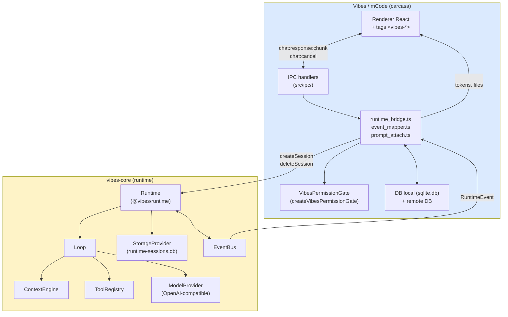

# Runtime ↔ Carcasa — La frontera Vibes ↔ vibes-core

> **Decisión arquitectónica en piedra** (Fase 1 P1 / Fase 2 alternativa Slice 2.2).
> Cualquier feature cross-cutting que toque ambos lados de la frontera debe
> justificar dónde vive **antes** de escribir código. Si no encaja en este
> doc, abre una issue.

---

## 1. La regla de oro

```
runtime (vibes-core)  →  no conoce UI, no conoce Vibes, no conoce OpenCode.
                         Solo sabe de RuntimeEvent, MessageContentPart,
                         ToolResult, Workspace, StorageProvider.

carcasa (Vibes/mCode) →  traduce RuntimeEvent a <vibes-*> tags para la UI.
                         Decide prompts, contextos, pills de permisos,
                         visionador sintético. El runtime nunca hace
                         preprocessing de visión.
```

**La línea es firme.** Si una feature pide meter algo de la carcasa en el
runtime, o algo del runtime en Vibes, **preguntar a munix antes**. Casi
siempre viola P1.

---

## 2. Diagrama de la frontera



**Puntos clave del diagrama:**
- El **único** camino de datos runtime→UI es vía `EventBus → runtime_bridge → event_mapper → IPC → renderer`.
- El **único** camino UI→runtime es vía `IPC → runtime_bridge → Runtime.createSession / cancel / deleteSession`.
- `VibesPermissionGate` vive en Vibes. El runtime NO sabe que existe un banner.
- `StorageProvider` (runtime-sessions.db) **no** es la DB de Vibes (sqlite.db / remote DB). Son DBs distintas.

---

## 3. Qué vive dónde

| Concepto | Vive en | Razón |
|---|---|---|
| `Runtime`, `RuntimeEvent`, `MessageContentPart` | vibes-core | Contratos públicos del runtime. |
| `SessionHandle`, `createSession`, `deleteSession` | vibes-core | Lifecycle de sesión (host-driven). |
| `StorageProvider` (SQLite en `runtime-sessions.db`) | vibes-core | El runtime es dueño de sus datos. Vibes no toca esta DB directamente. |
| `PermissionGate` interface | vibes-core | Contrato. |
| `createVibesPermissionGate` impl | Vibes | Una de N implementaciones posibles del contrato. |
| `opencode-permission:request` IPC channel | Vibes | Es un canal IPC de Vibes, no un evento runtime. |
| `<vibes-*>` tags (write, edit, files-changed, token-usage, cancelled) | Vibes (event_mapper.ts) | El renderer solo entiende tags de Vibes. |
| `readSettings()`, `openCodePermissions2` pills | Vibes | Config de UI, no del runtime. |
| Hydration de historial (DP-4) | Vibes (runtime_bridge.ts) | El runtime no sabe de la DB de chats. |
| `attachToSystemPrompt` (context instructions) | Vibes (runtime/prompt_attach.ts) | El runtime recibe el system prompt ya compuesto. |
| Sub-agentes, sub-tasks | vibes-core (Fase 2+) | Cuando llegue, vivirá en vibes-core como tool del loop. |
| `ask_user` tool (DP-3, pendiente) | vibes-core (cuando se implemente) | El runtime tiene que emitir el evento `permission.ask` para que la carcasa lo muestre. |
| Visual-edit subagent (deuda) | vibes-core (Fase 5) | Cuando se implemente, vivirá como tool/sub-agent del loop. |
| MCP gateway (DP-Fase 3) | vibes-core (Fase 3) | El runtime tiene que poder hablar MCP. |
| Attachments / vision | Vibes (mCode) | DP-2. La carcasa decide qué hacer cuando no hay visión (synthetic viewer). El runtime nunca preprocessa. |

---

## 4. Anti-patrones — código real que NO debe repetirse

### ❌ Anti-patrón 1: Importar `electron`, UI, o Vibes desde vibes-core

```ts
// MAL — en cualquier archivo de packages/runtime-*
import { app } from "electron";
import { BrowserWindow } from "electron";
```

**Por qué:** el runtime se usa también en el CLI (`vibes run`), el server
HTTP, y potencialmente SDKs externos. Cualquier dependencia de Electron
rompe esos targets.

**Cómo detectarlo:** `grep -rn "from \"electron\"" packages/runtime/ packages/runtime-impl/` debe devolver 0.

### ❌ Anti-patrón 2: Renderer entiende `RuntimeEvent` directamente

```ts
// MAL — en el renderer
socket.on("runtime-event", (e: RuntimeEvent) => {
  if (e.type === "tool.started") { /* ... */ }
});
```

**Por qué:** el renderer no debe saber de la jerarquía de eventos del
runtime. Si mañana cambia el shape de `RuntimeEvent`, rompes la UI.

**Cómo detectarlo:** `grep -rn "RuntimeEvent" src/renderer/` debe devolver 0 (salvo re-exports a través de types).

### ❌ Anti-patrón 3: Vibes mete estado UI en el runtime

```ts
// MAL — Vibes pasando contexto UI al runtime
runtime.createSession({
  prompt: "...",
  uiContext: { chatId, windowId, sender }, // ❌ no
});
```

**Por qué:** el runtime no necesita saber de ventanas ni chats. Esa
asociación la mantiene Vibes en `activeSessionByChat: Map<number, string>`.

**Cómo detectarlo:** buscar `uiContext`, `windowId`, `chatId` en firmas de
funciones de `@vibes/runtime` y `@vibes/runtime-impl`.

### ❌ Anti-patrón 4: Runtime prompt con instrucciones de UI

```ts
// MAL — el runtime componiendo system prompts con cosas de Vibes
const systemPrompt = `
  You are an AI assistant.
  When you modify a file, output a <vibes-write> tag.
  The current chat ID is ${chatId}.
  The current window is ${windowId}.
`;
```

**Por qué:** el sistema prompt debe ser agnóstico. Los tags `<vibes-*>` se
inyectan/extraen en la capa de mapeo de eventos, no en el prompt.

**Cómo detectarlo:** `grep -rn "vibes-write\|vibes-edit" packages/runtime/ packages/runtime-impl/`

### ❌ Anti-patrón 5: Vibes lee `runtime-sessions.db` directamente

```ts
// MAL — Vibes abriendo la DB del runtime
import Database from "better-sqlite3";
const db = new Database("/path/to/runtime-sessions.db");
const sessions = db.prepare("SELECT * FROM sessions").all();
```

**Por qué:** la DB del runtime es interna. Si Vibes la lee directamente,
cualquier cambio de schema rompe la app. El runtime expone queries vía la
interfaz `StorageProvider`.

**Cómo detectarlo:** buscar paths a `runtime-sessions.db` fuera de `runtime_host.ts`.

---

## 5. Procedimiento para features cross-cutting

Cuando una feature toca ambos lados:

1. **Escribir el contrato primero.** ¿Qué evento/entrada/salida cruza la frontera?
2. **Decidir el lado del "dueño del estado".** Si el estado es del runtime
   (sesiones, planes, tool calls), el runtime expone la API. Si es de Vibes
   (UI, settings, chats), Vibes expone la API.
3. **Escribir el evento runtime (si aplica).** Definir un nuevo `RuntimeEvent`
   type en `@vibes/shared` con su mapper en `event_mapper.ts`.
4. **Implementar del lado del runtime.** Sin imports de UI.
5. **Implementar del lado de Vibes.** Mapea el evento a tag/acción UI.
6. **Tests contract.** El bridge (`runtime_bridge.contract.test.ts`) debe
   verificar que el output del runtime cruza correctamente con el formato
   que el renderer espera.

**Si en cualquier paso dudas:** abre issue. No escribas código hasta tener
un OK explícito de munix.

---

## 6. Referencias cruzadas

- [Roadmap principal](file:///home/munix/Desarrollo/GitRepo/Vibes/docs/plans/implementation_plan.md) — decisión original P1.
- [AGENTS.md](file:///home/munix/Desarrollo/GitRepo/Vibes/.agents/rules/AGENTS.md) — reglas del proyecto Vibes (§1.6 = frontera runtime ↔ carcasa).
- [AGENTS.md de vibes-core](file:///home/munix/Desarrollo/GitRepo/vibes-core/.agents/rules/AGENTS.md) — reglas del runtime (§1.6 = naturaleza del runtime).
- [phase2-hardening.md](file:///home/munix/Desarrollo/GitRepo/Vibes/docs/plans/phase2-hardening.md) — plan que dio origen a este doc.
- [post-mvp-roadmap.md §"Deuda del swap B6"](file:///home/munix/Desarrollo/GitRepo/Vibes/docs/plans/post-mvp-roadmap.md) — features que cruzan la frontera y están pendientes.
- [walkthrough.md](file:///home/munix/Desarrollo/GitRepo/Vibes/docs/plans/walkthrough.md) — cómo quedó la frontera tras el swap B6.

---

**Última actualización:** 2026-08-09 (Fase 2 alternativa Slice 2.2).
**Mantenedor:** munix.
